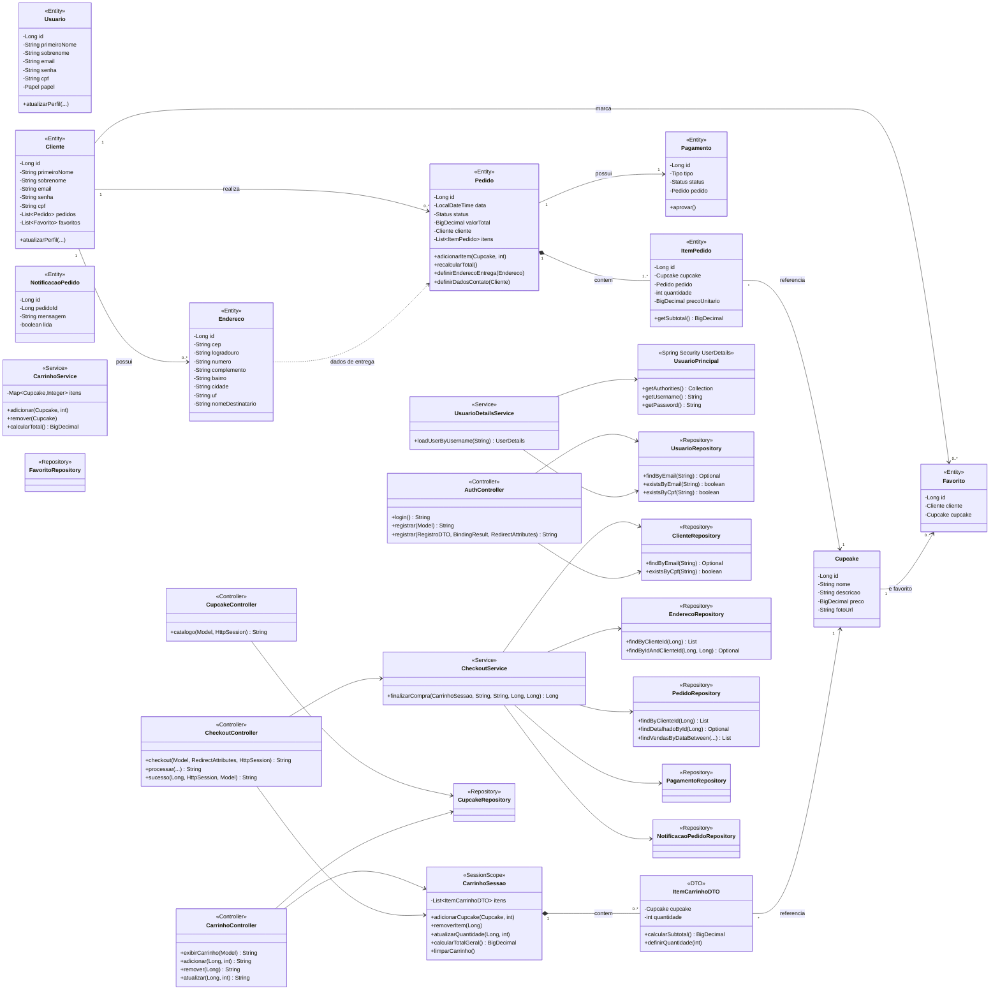

# Diagrama de classes

```mermaid
classDiagram
    direction LR

    class Cupcake {
        -Long id
        -String nome
        -String descricao
        -BigDecimal preco
        -String fotoUrl
    }

    class Usuario {
        <<Entity>>
        -Long id
        -String primeiroNome
        -String sobrenome
        -String email
        -String senha
        -String cpf
        -Papel papel
        +atualizarPerfil(...)
    }

    class Cliente {
        <<Entity>>
        -Long id
        -String primeiroNome
        -String sobrenome
        -String email
        -String senha
        -String cpf
        -List~Pedido~ pedidos
        -List~Favorito~ favoritos
        +atualizarPerfil(...)
    }

    class Endereco {
        <<Entity>>
        -Long id
        -String cep
        -String logradouro
        -String numero
        -String complemento
        -String bairro
        -String cidade
        -String uf
        -String nomeDestinatario
    }

    class Pedido {
        <<Entity>>
        -Long id
        -LocalDateTime data
        -Status status
        -BigDecimal valorTotal
        -Cliente cliente
        -List~ItemPedido~ itens
        +adicionarItem(Cupcake, int)
        +recalcularTotal()
        +definirEnderecoEntrega(Endereco)
        +definirDadosContato(Cliente)
    }

    class ItemPedido {
        <<Entity>>
        -Long id
        -Cupcake cupcake
        -Pedido pedido
        -int quantidade
        -BigDecimal precoUnitario
        +getSubtotal() BigDecimal
    }

    class Pagamento {
        <<Entity>>
        -Long id
        -Tipo tipo
        -Status status
        -Pedido pedido
        +aprovar()
    }

    class Favorito {
        <<Entity>>
        -Long id
        -Cliente cliente
        -Cupcake cupcake
    }

    class NotificacaoPedido {
        <<Entity>>
        -Long id
        -Long pedidoId
        -String mensagem
        -boolean lida
    }

    class CarrinhoSessao {
        <<SessionScope>>
        -List~ItemCarrinhoDTO~ itens
        +adicionarCupcake(Cupcake, int)
        +removerItem(Long)
        +atualizarQuantidade(Long, int)
        +calcularTotalGeral() BigDecimal
        +limparCarrinho()
    }

    class ItemCarrinhoDTO {
        <<DTO>>
        -Cupcake cupcake
        -int quantidade
        +calcularSubtotal() BigDecimal
        +definirQuantidade(int)
    }

    class CheckoutService {
        <<Service>>
        +finalizarCompra(CarrinhoSessao, String, String, Long, Long) Long
    }

    class CarrinhoService {
        <<Service>>
        -Map~Cupcake,Integer~ itens
        +adicionar(Cupcake, int)
        +remover(Cupcake)
        +calcularTotal() BigDecimal
    }

    class UsuarioDetailsService {
        <<Service>>
        +loadUserByUsername(String) UserDetails
    }

    class CupcakeController {
        <<Controller>>
        +catalogo(Model, HttpSession) String
    }

    class CarrinhoController {
        <<Controller>>
        +exibirCarrinho(Model) String
        +adicionar(Long, int) String
        +remover(Long) String
        +atualizar(Long, int) String
    }

    class CheckoutController {
        <<Controller>>
        +checkout(Model, RedirectAttributes, HttpSession) String
        +processar(...) String
        +sucesso(Long, HttpSession, Model) String
    }

    class AuthController {
        <<Controller>>
        +login() String
        +registrar(Model) String
        +registrar(RegistroDTO, BindingResult, RedirectAttributes) String
    }

    class UsuarioPrincipal {
        <<Spring Security UserDetails>>
        +getAuthorities() Collection
        +getUsername() String
        +getPassword() String
    }

    class CupcakeRepository {
        <<Repository>>
    }
    class UsuarioRepository {
        <<Repository>>
        +findByEmail(String) Optional
        +existsByEmail(String) boolean
        +existsByCpf(String) boolean
    }
    class ClienteRepository {
        <<Repository>>
        +findByEmail(String) Optional
        +existsByCpf(String) boolean
    }
    class EnderecoRepository {
        <<Repository>>
        +findByClienteId(Long) List
        +findByIdAndClienteId(Long, Long) Optional
    }
    class PedidoRepository {
        <<Repository>>
        +findByClienteId(Long) List
        +findDetalhadoById(Long) Optional
        +findVendasByDataBetween(...) List
    }
    class PagamentoRepository {
        <<Repository>>
    }
    class FavoritoRepository {
        <<Repository>>
    }
    class NotificacaoPedidoRepository {
        <<Repository>>
    }

    Cliente "1" --> "0..*" Pedido : realiza
    Cliente "1" --> "0..*" Endereco : possui
    Cliente "1" --> "0..*" Favorito : marca
    Cupcake "1" --> "0..*" Favorito : e favorito
    Pedido "1" *-- "1..*" ItemPedido : contem
    ItemPedido "*" --> "1" Cupcake : referencia
    Pedido "1" --> "1" Pagamento : possui
    Endereco ..> Pedido : dados de entrega
    CarrinhoSessao "1" *-- "0..*" ItemCarrinhoDTO : contem
    ItemCarrinhoDTO "*" --> "1" Cupcake : referencia

    CupcakeController --> CupcakeRepository
    CarrinhoController --> CupcakeRepository
    CarrinhoController --> CarrinhoSessao
    CheckoutController --> CheckoutService
    CheckoutController --> CarrinhoSessao
    CheckoutService --> ClienteRepository
    CheckoutService --> EnderecoRepository
    CheckoutService --> PedidoRepository
    CheckoutService --> PagamentoRepository
    CheckoutService --> NotificacaoPedidoRepository
    AuthController --> UsuarioRepository
    AuthController --> ClienteRepository
    UsuarioDetailsService --> UsuarioRepository
    UsuarioDetailsService --> UsuarioPrincipal
```

`CarrinhoSessao` representa `model.session.Carrinho`, separado da entidade
`model.entity.Carrinho`, que pertence ao modelo persistente do cliente.

